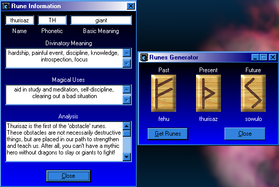



## A Runic Oracle

### Description

((UPDATE)) I have compiled the images into a resource file. Makes it a bit cleaner and a fraction faster. This program generates a simple Runic layout (Past, Present, Future) for simple divination. It uses an Access2000 DB to store the Runes' information. It is far from complete, but it works. I wrote this for a friend of mine in another city. She wanted quick access to the info on the runes. Please, leave me some suggestions. I don't really care about votes.
 
### More Info
 

             |
---                |---
**Submitted On**   |2000-08-08 08:55:14
**By**             |[VBScript](https://github.com/Planet-Source-Code/PSCIndex/blob/master/ByAuthor/vbscript.md)
**Level**          |Intermediate
**User Rating**    |4.3 (30 globes from 7 users)
**Compatibility**  |VB 6\.0
**Category**       |[Complete Applications](https://github.com/Planet-Source-Code/PSCIndex/blob/master/ByCategory/complete-applications__1-27.md)
**World**          |[Visual Basic](https://github.com/Planet-Source-Code/PSCIndex/blob/master/ByWorld/visual-basic.md)
**Archive File**   |[CODE\_UPLOAD8733882000\.zip](https://github.com/Planet-Source-Code/vbscript-a-runic-oracle__1-10474/archive/master.zip)

